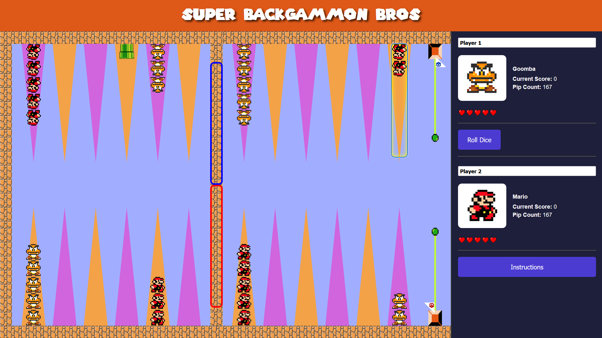

# Super Backgammon Bros

Super Backgammon Bros is a Mario-themed reimagining of classic backgammon, featuring Goombas vs. Marios in a vibrant and interactive web game.

It defines a module,  
`web-app/backgammon.js`,  
for representing and playing backgammon in functional JavaScript using [Ramda](https://ramdajs.com/).  
This module exposes pure functions for dice rolls, board state updates, and legal move calculations.

A front-end application is written to wrap the backgammon module in a browser-based  
web app,  
`web-app/`  
This web app is designed with a nostalgic Mario theme, including both visiuals and music.

## Installation
* Clone the repository.
* Run `npm install` in the root directory to install dependencies (ramda, etc.).

## Accessible Controls
Press **R** to roll the dice, **S** to swap the dice, **I** to toggle instructions, use the **left and right arrow keys** to select a checker stack, and press **Enter** or **Space** to move a checker from the selected stack.

